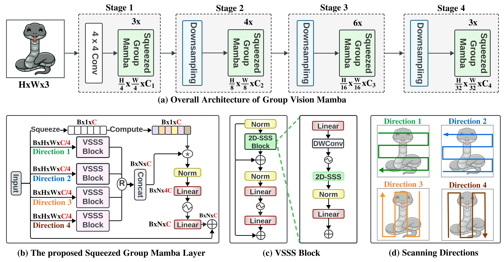
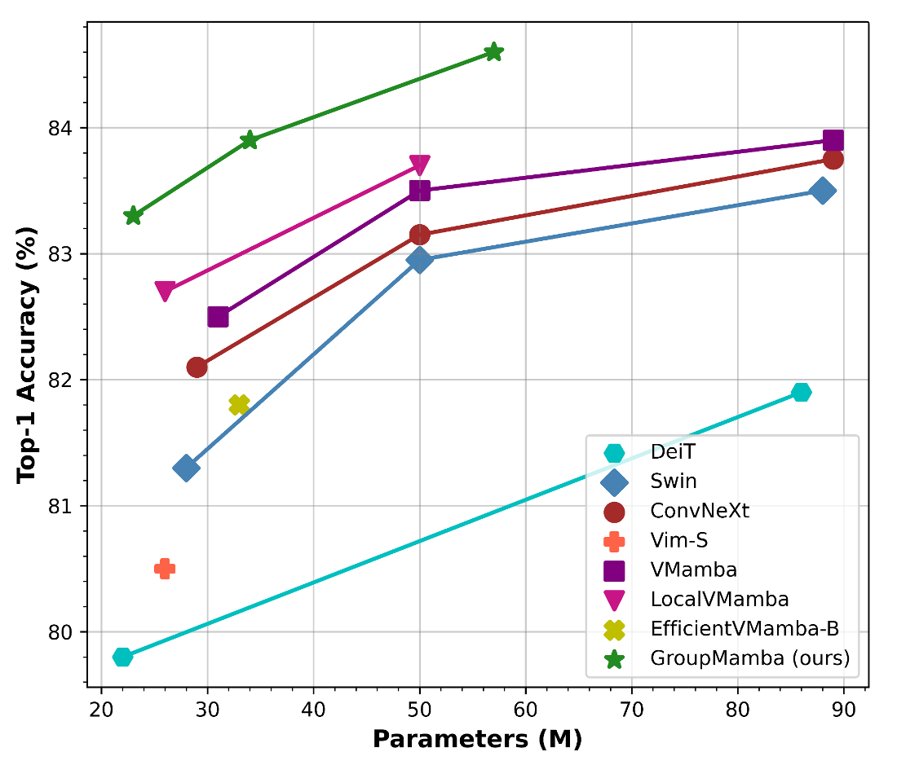
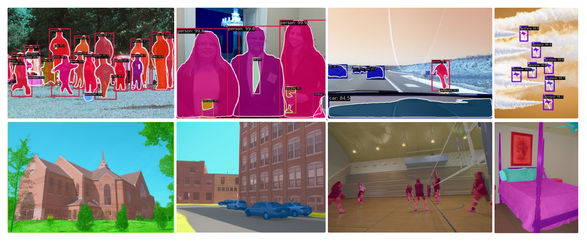

<div align="center">
<h1>Group Mamba </h1>
<h3>GroupMamba: Parameter-Efficient and Accurate Group Visual State Space Model</h3>


[Abdelrahman Shaker](https://amshaker.github.io/)<sup>1</sup>, [Syed Talal Wasim](https://talalwasim.github.io/)<sup>2</sup>, [Salman Khan](https://salman-h-khan.github.io/)<sup>1</sup>, [Jürgen Gall](https://pages.iai.uni-bonn.de/gall_juergen/)<sup>2</sup>, and [Fahad Khan](https://sites.google.com/view/fahadkhans/home)<sup>1,3</sup>

<sup>1</sup>  Mohamed Bin Zayed University or Artificial Intelligence, <sup>2</sup>  University of Bonn,  <sup>3</sup> Linköping University.

[](https://amshaker.github.io/GroupMamba/)
[](https://arxiv.org/pdf/2407.13772)


</div>

## :rocket: News
* **(Jul 18, 2024):** Training and evaluation code along with pre-trained models are released.


## Abstract

Recent advancements in state-space models (SSMs) have showcased effective performance in modeling long-range dependencies with subquadratic complexity. However, pure SSM-based models still face challenges related to stability and achieving optimal performance on computer vision tasks. Our paper addresses the challenges of scaling SSM-based models for computer vision, particularly the instability and inefficiency of large model sizes. To address this, we introduce a Modulated Group Mamba layer which divides the input channels into four groups and applies our proposed SSM-based efficient Visual Single Selective Scanning (VSSS) block independently to each group, with each VSSS block scanning in one of the four spatial directions. The Modulated Group Mamba layer also wraps the four VSSS blocks into a channel modulation operator to improve cross-channel communication.
Furthermore, we introduce a distillation-based training objective to stabilize the training of large models, leading to consistent performance gains. Our comprehensive experiments demonstrate the merits of the proposed contributions, leading to superior performance over existing methods for image classification on ImageNet-1K, object detection, instance segmentation on MS-COCO, and semantic segmentation on ADE20K. 
Our tiny variant with 23M parameters achieves state-of-the-art performance with a classification top-1 accuracy of 83.3% on ImageNet-1K, while being 26% efficient in terms of parameters, compared to the best existing Mamba design of same model size.

## Overview

<div align="center">

</div>

## Comparison with recent architectures on ImageNet-1k
 

<div align="center">

</div>

## Model Weights

|                                     Model                                      |  pretrain  | Image Res. | #param. | Top-1 Acc. |                             Model                             |
|:------------------------------------------------------------------------------:|:----------:|:----------:|:-------:|:----------:|:---------------------------------------------------------:|
| [GroupMamba - Tiny](https://huggingface.co/Abdelrahman-shaker/GroupMamba-Tiny) | ImageNet-1k |  224x224   |   23M   |    83.3    | [Link](https://drive.google.com/file/d/1TrYYs0uGZbja_2ONQLyfiNdp8C5ZYP1o/view?usp=sharing)  |
|  [GroupMamba - Small](https://huggingface.co/Abdelrahman-shaker/GroupMamba-Small)  |    ImageNet-1k     |  224x224   |   34M   |    83.9    | [Link](https://drive.google.com/file/d/1vTN9ynDcsDuOVrcT9GcQ5nBSk-hXySlh/view?usp=sharing) |
|     [GroupMamba - Base](https://huggingface.co/Abdelrahman-shaker/GroupMamba-Base)     |    ImageNet-1k     |  224x224   |   57M   |    84.5    | [Link](https://drive.google.com/file/d/1A_srBeDYpsinU5W3PAEADu1saoz413EU/view?usp=sharing) |

## Qualitative Results (Detection & Segmentation)


## Getting Started

### Installation

**Step 1: Clone the GroupMamba repository:**

To get started, first clone the GroupMamba repository and navigate to the project directory:

```bash
git clone https://github.com/amshaker/GroupMamba.git
cd GroupMamba
```

**Step 2: Environment Setup:**

We recommend setting up a conda environment and installing dependencies via pip. Use the following commands to set up your environment:

***Create and activate a new conda environment***

```bash
conda create -n groupmamba
conda activate groupmamba
```


***Install Dependencies***

```bash
pip install -r requirements.txt
cd kernels/selective_scan && pip install .
```
<!-- cd kernels/cross_scan && pip install . -->


### Dataset Preparation
Download the [ImageNet-1K](http://image-net.org/) classification dataset and structure the data as follows:
```
/path/to/imagenet-1k/
  train/
    class1/
      img1.jpeg
    class2/
      img2.jpeg
  val/
    class1/
      img3.jpeg
    class2/
      img4.jpeg
```
### Model Training and Evaluation

To train GroupMamba models for classification on ImageNet, use the following commands for different configurations:

```bash
python -m torch.distributed.launch --nnodes=1 --node_rank=0 --nproc_per_node=8 --master_addr="127.0.0.1" --master_port=29501 train.py --groupmamba-model groupmamba_tiny --batch-size 128 --data-path </path/of/dataset> --output /tmp
```

Download the pretrained weights and run the following command for evaluation on ImageNet-1K dataset:

```bash
python -m torch.distributed.launch --nnodes=1 --node_rank=0 --nproc_per_node=1 --master_addr="127.0.0.1" --master_port=29501 eval.py --groupmamba-model groupmamba_tiny --batch-size 128 --data-path </path/of/dataset> --evaluate </path/of/checkpoint>
```


## References
Our code is based on [VMamba](https://github.com/MzeroMiko/VMamba) repository. 
We thank them for releasing their code.


## Citation
If you use our work, please consider citing:
```
@inproceedings{shaker2024GroupMamba,
  title={GroupMamba: Parameter-Efficient and Accurate Group Visual State Space Model},
  author={Abdelrahman Shaker and Syed Talal Wasim and Salman Khan and Gall Jürgen and Fahad Shahbaz Khan},
  journal={arXiv preprint arXiv:2407.13772},
  year={2024},
  url={https://arxiv.org/pdf/2407.13772}
}
```
