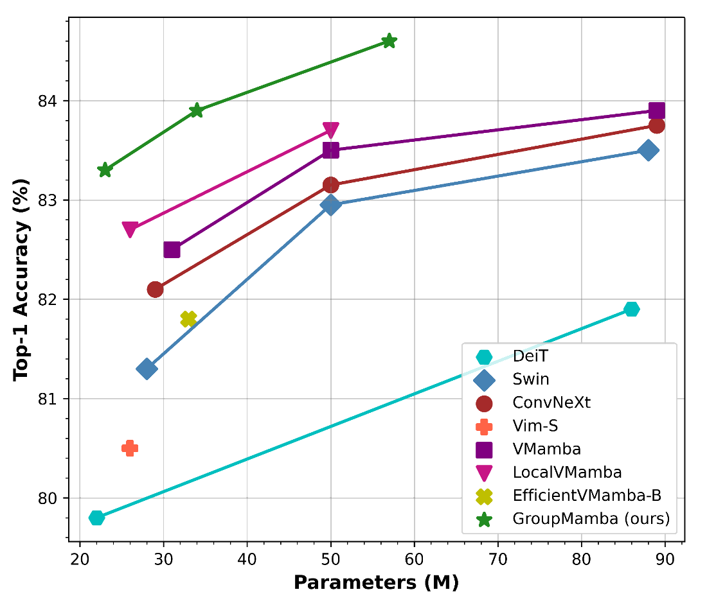
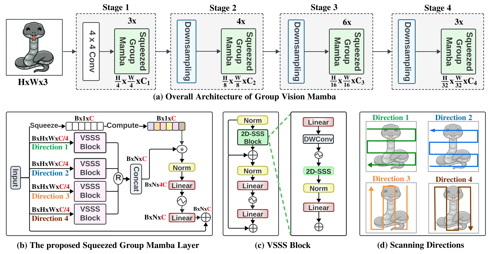
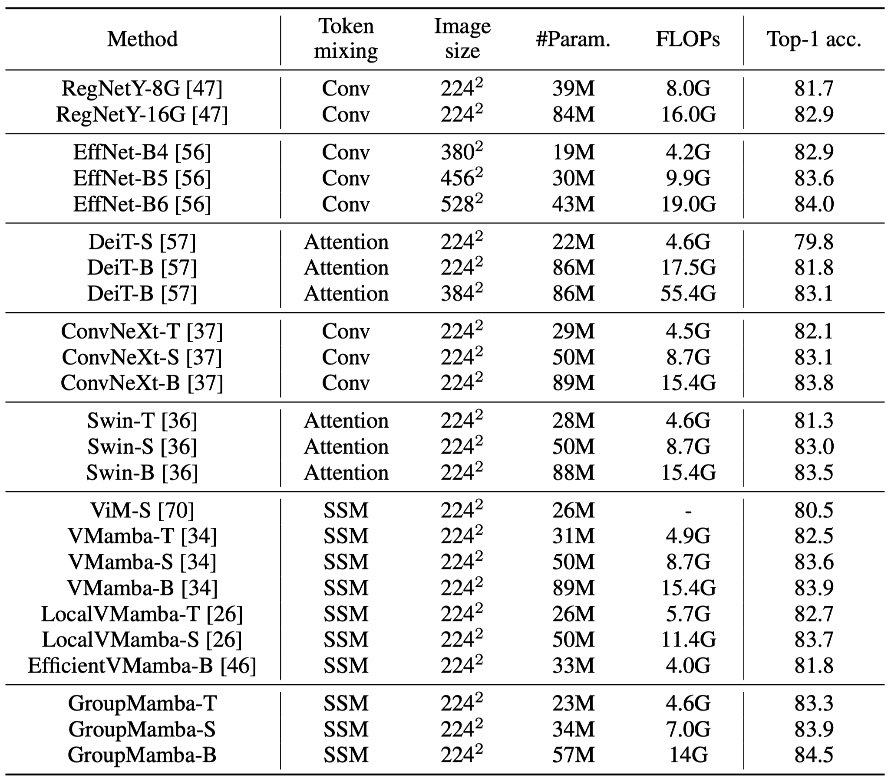
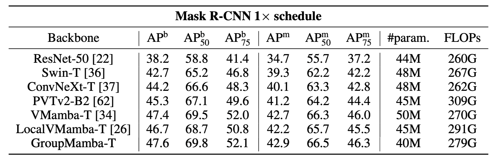
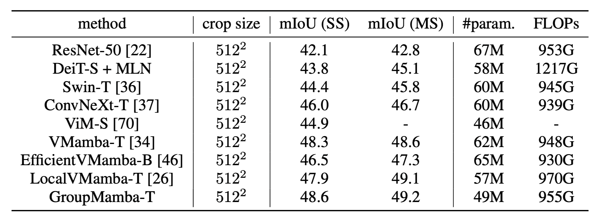
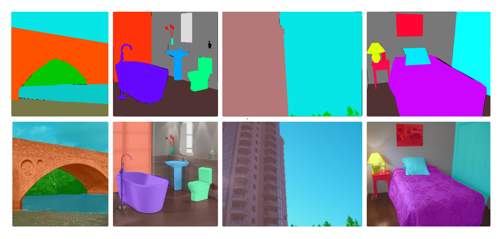

[Abdelrahman Shaker](https://amshaker.github.io/), [Syed Talal Wasim](https://talalwasim.github.io/), [Salman Khan](https://salman-h-khan.github.io/), [Jürgen Gall](https://pages.iai.uni-bonn.de/gall_juergen/), and [Fahad Khan](https://sites.google.com/view/fahadkhans/home)


<br>

&emsp;&emsp;&emsp;&emsp;&emsp;&emsp;&emsp;&emsp;&emsp;&emsp;&emsp;&emsp;&emsp;&emsp;&emsp;&emsp;&emsp;&emsp;&emsp;&emsp;&emsp;&emsp;&emsp;&emsp;&emsp;&emsp;&emsp;&emsp;&emsp;&emsp;&emsp;&emsp;&emsp;&emsp;&emsp;&emsp;&emsp;&emsp;&emsp;&emsp;&emsp;&emsp;&emsp;&emsp;&emsp;&emsp;&emsp;&emsp;&emsp;&emsp;  [Paper](): [](PAPER)  , [Code:](https://github.com/Amshaker/GroupMamba) [](https://github.com/Amshaker/GroupMamba)

<br>

## News
* **(Jul 19, 2024):** GroupMamba training and evaluation codes are released.
  
## Introduction
<p align="center">
<!--  -->

</p>
<p align="justify" style="width:740px;">
We introduce GroupMamba, inspired by GroupConvolution, designed to enhance computational efficiency and interaction within state-space models. By employing a multi-directional scanning method, GroupMamba ensures comprehensive spatial coverage and effective modeling of both local and global information. We present a series of parameter-efficient generic classification models under the GroupMamba name, based on our proposed Modulated Group Mamba layer.
Our tiny variant achieves 83.3% top-1 accuracy on ImageNet-1k with just 23M parameters. Furthermore, the base variant reaches a top-1 accuracy of 84.5% with 57M parameters, outperforming all recent state-space model methods.
</p>


## Overview



<p align="justify" style="width:740px;">
Overview of the proposed method. Top Row: The overall architecture of our framework
with a consistent hierarchical design comprising four stages. Bottom Row: We present (b) The design
of the modulated group mamba layer. The input channels are divided into four groups with a single
scanning direction for each VSSS block. This significantly reduces the computational complexity
compared to the standard mamba layer, with similar performance. Channel Affinity Modulation
mechanism is introduced to address the limited interactions within the VSSS blocks. (c) The design
of VSSS block. It consists of Mamba block with 1D Selective Scanning block followed by FFN. (d)
The four scanning directions used for the four VSSS blocks are illustrated.
</p>

## Model Zoo

|                                     Model                                      |  pretrain  | Image Res. | #param. | Top-1 Acc. |                             Model                             |
|:------------------------------------------------------------------------------:|:----------:|:----------:|:-------:|:----------:|:---------------------------------------------------------:|
| [GroupMamba - Tiny](https://huggingface.co/Abdelrahman-shaker/GroupMamba-Tiny) | ImageNet-1k |  224x224   |   23M   |    83.3    | [Link](https://drive.google.com/file/d/1TrYYs0uGZbja_2ONQLyfiNdp8C5ZYP1o/view?usp=sharing)  |
|  [GroupMamba - Small](https://huggingface.co/Abdelrahman-shaker/GroupMamba-Small)  |    ImageNet-1k     |  224x224   |   34M   |    83.9    | [Link](https://drive.google.com/file/d/1vTN9ynDcsDuOVrcT9GcQ5nBSk-hXySlh/view?usp=sharing) |
|     [GroupMamba - Base](https://huggingface.co/Abdelrahman-shaker/GroupMamba-Base)     |    ImageNet-1k     |  224x224   |   57M   |    84.5    | [Link](https://drive.google.com/file/d/1A_srBeDYpsinU5W3PAEADu1saoz413EU/view?usp=sharing) |


## Comparison on ImageNet-1k



## Comparison on Object Detection and Instance Segmentation


## Comparison on Semantic Segmentation


## Qualitative Results (Object Detection and Instance Segmentation)


## Qualitative Results (Semantic Segmentation)


## Citation
If you use our work, please consider citing:
```
@inproceedings{shaker2024GroupMamba,
  title={GroupMamba: Parameter-Efficient and Accurate Group Visual State Space Model},
  author={Abdelrahman Shaker and Syed Talal Wasim and Salman Khan and Gall Jürgen and Fahad Shahbaz Khan},
  journal={arXiv preprint arXiv:x.x},
  year={2024}
}
```

## Contact
Should you have any question, please create an issue on this repository or contact me at abdelrahman.youssief@mbzuai.ac.ae.

